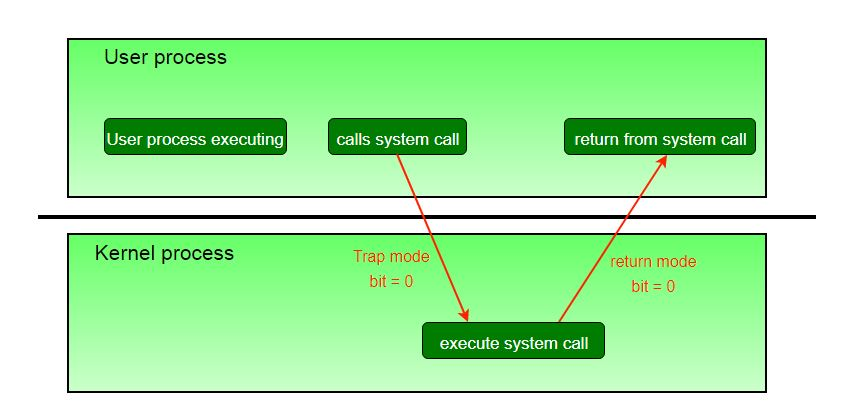

# 운영체제 개요
## 운영체제

컴퓨터의 하드웨어 자원을 관리하고 컴퓨터 프로그램이 동작하기 위해 제공하는 시스템 소프트웨어

사용자 지원

- 사용자의 명령을 해석하여 실행
- 사용자와 하드웨어 사이의 매개체 역할 수행

### CPU의 동작 모드

- 슈퍼 바이저 모드 (커널 모드)
    - 운영체제의 커널이 동작되는 모드
    - 하드웨어를 직접 제어할 수 있는 CPU 명령어 사용 가능
- 보호 모드(사용자 모드)
    - 응용 프로그램이 동작되는 모드
    - 하드웨어로를 직접 제어할 수 있는 CPU 명령어 사용 불가능.

그럼 어떻게  보호에서 슈퍼바이저 모드로 전환?

- system call
    - 응용 프로그램이 운영체제에게 서비스를 요청하는 메커니즘

순서: 시스템 호출 → 보호모드에서 슈퍼바이저 모드로 변경 → 커널 동작 → 하드웨어 제어

### 커널

- 운영체제의 핵심 요소
- 응용 프로그램과 하드웨어 수준의 처리 사이의 가교 역할
- 대표적인 구성 방식: 일체형 커널, 마이크로 커널

일체형 커널 (monolithic kernel)

- 운영체제의 모든 서비스가 커널 내에 포함됨
- 장점
    - 커널 내부 요소들이 서로 효율적으로 상호작용할 수 있음.
- 단점
    - 한 요소에 있는 오류로 인해 시스템 전체 장애 발생할 수 있음
    - 예) UNX, Linux

마이크로 커널

- 운영체제의 대부분의 요소들을 커널 외부로 분리
- 커널 내에는 메모리 관리, 멀티 태스킹, 프로세스 간 통신(IPC) 등 최소한의 요소만 남김
- 장점
    - 새로운 서비스를 추가하여 운영체제 확장 쉬움
    - 유지 보시 용이, 안정성 우수
- 단점
    - 커널 외부 요소들 사이에는 IPC를 통해야만 하므로 성능 저하가 발생

## 운영체제 구성

프로세스 관리자

- 프로세스를 생성, 삭제 , CPU 할등을 위한 스케줄 결정.

메모리 관리자

- 메모리 공간에 대한 요구의 유효성 검사
- 메모리 할당 및 회수, 공간 보호

장치 관리자

- 컴퓨터 시스템의 모든 장치를 관리
- 시스템의 장치를 할당, 작동 시작, 반환

파일 관리자

- 컴퓨터 시스템의 모든 파일을 관리
- 파일의 접근 제한 관리
- 파일을 열어 자원을 할당하거나 파일을 닫아 자원을 회수

## 운영체제의 유형

- 일괄처리 운영체제 (초기)
    - 작업을 모아서 처리
    - 사용자와 상호작용 없이 순차적으로 실행
    - 효율성 평가: 처리량, 반환시간 (시작부터 끝나는 시간)
- 대화형(interactive) 운영체제
    - 시분할 운영체제라고도 함
    - 일괄처리 운영체제보다 빠르지만, 실시간 운영체제보다 느린 응답시간(요청한 시점부터 반응이 시작되는 시점).
    - 이용자에게 즉각적인 피드백을 제공
- 실시간(real-time) 운영체제 (RTOS)
    - 가장 빠른 응답시간
    - 처리의 결과가 현재의 결정에 영향을 주는 환경에서 사용
    - 특수 목적으로 사용: 우주 비행 시스템, 미사일 제어, 증권 거래 관리 시스템, 은행 입출금 시스템 등에 사용
- 하이브리드 운영체제
    - 일괄처리 운영체제와 대화형 운영체제의 결합
    - 이용자는 터미널을 통해 접속하고 빠른 응답시간을 얻음
    - 대화형 작업이 많지 않은 경우 백그라운드에서 배치 프로그램 실행
    - 현재 사용되고 있는 대부분의 대형 컴퓨터 시스템은 하이브리드 운영체제.
