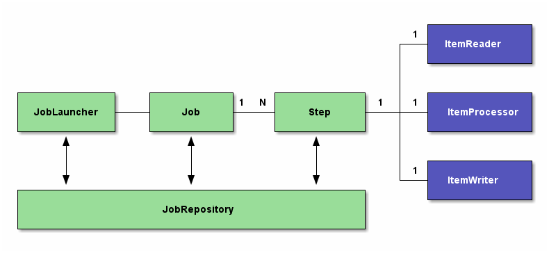

### 배치 애플리케이션이란?
단발성 대용량의 데이터를 처리하는 애플리케이션. 배치 어플리케이션은 다음의 조건을 만족해야한다.
- 대용량: **대량의 데이터**를 가져오거나, 계산하는 등의 처리가 가능해야 한다.
- 자동화:  사용자의 개입 없이 **자동**으로 실행.
- 견고성: **충돌/중단 없이** 진행되어야 한다.
- 신뢰성: 로깅 알림을 통해 **이슈를 추적**.
- 성능: **독립적인 수행**과 **퍼포먼스**가 보장되어야한다.

### Reader & Writer
|Data|기술|설명|
|---|---|---|
|Datbase|jdbc|페이징, 커서 업데이트 등|
|Datbase|Hiberbate|페이징 커서
|Datbase|JPA|페이징 사용 가능
|File|Flat file|지정한 구분자로 파싱 지원
|File|XML|XML 파싱 지원

</br>

### 스프링 배치 기본 구조 & 처리 흐름도


</br>
[reference](https://terasoluna-batch.github.io/guideline/5.0.0.RELEASE/en/Ch02_SpringBatchArchitecture.html)


[source](https://terasoluna-batch.github.io/guideline/5.0.0.RELEASE/en/Ch02_SpringBatchArchitecture.html)

### Job
- 일련의 프로세스를 요약하는 단일 실행 단위.

``` java
@Bean
public Job simpleJob() {
    return jobBuilderFactory.get("Job Name")
        .start(step())
        .build();
}
```

### Step
- Job을 구성하는 처리 단위. 하나의 Job에 여러 Step이 포함될 수 있다. 조건부 수행, 병렬화 등 가능.

``` java
@Bean Step stepBean() {
    return stepBuilderFactory.get("simpleStep1")
    .tasklet((contribution, chunkContext) -> {
        log.info(">>> This is Step1 <<<");
         return RepeatStatus.FINISHED;
    })
    .build();
}
```

## Meta-Data Schema


</br>
[source](https://docs.spring.io/spring-batch/docs/current/reference/html/schema-appendix.html)


### BATCH_JOB_INSTANCE
- JobInstance와 관련된 정보를 담고있다. 전체 계층 구조의 최상위 역할을 한다.

같은 Batch Job이라도 Job Paramter가 다르면 `BATCH_JOB_INSTANCE`에는 기록된다. Job PAramter가 성공한 이력이 있을 경우 똑같은 값은 실행되지 않는다. `JobInstanceAlreadyCompleteException` 발생.

``` java
@Bean
public Job simpleJob() {
    return jobBuilderFactory.get("simpleJob") 
        .start(simpleStep(null))
        .build();
}

@Bean
@JobScope
public Step simpleStep1(@Value("#{jobParameters[requestDate]}") String requestDate) {
return stepBuilderFactory.get("simpleStep1")
    .tasklet((contribution, chunkContext) -> {
        log.info(">>> This is Step <<<");
        log.info(">>> requestDate = {}", requestDate);
        return RepeatStatus.FINISHED;
    })
    .build();
}
```

</br>

### BATCH_JOB_INSTANCE


- 동일한 파라미터 실행시 `JobInstanceAlreadyCompleteException` 발생
  


### BATCH_JOB_EXECUTION
`JobExecution` 객체와 관련된 모든 정보를 보유한다. Job이 실행될 때마다 항상 새 JobExecution과 새 행이 있다.

### BATCH_JOB_EXECUTION_PARAMS

`JobParamters` 객체와 관련된 모든 정보를 보유한다.


---

## JOB_FLOW

- on(): 캐치할 ExitStatus
- to(): next step 지정
- from(): 해당 step에서(등록된) 이벤트 리스너 역할 수행
- end(): FlowBuilder를 종료 / 반환하는 메서드가 두 종류

``` java
@Slf4j
@Configuration
@RequiredArgsConstructor
public class ConditionalJob {

    private final JobBuilderFactory jobBuilderFactory;
    private final StepBuilderFactory stepBuilderFactory;

    @Bean
    public Job stepNextConditionalJob() {
        return jobBuilderFactory.get("testJob")
                .start(step1())
                    .on("FAILED") // FAILED 이면
                    .to(step3()) // step3 실행.
                    .on("*") // step3의 결과 관계 없이 
                    .end() // flow 종료.
                .from(step1()) // step1d 에서
                    .on("*") // FAILED 외에 모든 경우 (앞에서 FAILE를 잡았으니)
                    .to(step2()) // step2 실행.
                    .next(step3()) // 정상 종료시 step3 실행
                    .on("*") // step3의 결과 관계 없이 
                    .end() // Flow 종료.
                .end() // Job 종료
                .build();
    }

    @Bean
    public Step conditionalJobStep1() {
        return stepBuilderFactory.get("step1")
            .tasklet((contribution, chunkContext) -> {
                log.info(">>>>> This is Step1");
                contribution.setExitStatus(ExitStatus.FAILED); // Status Failed
                return RepeatStatus.FINISHED;
            })
            .build();
    }

    @Bean
    public Step step2() {
        return stepBuilderFactory.get("step2")
            .tasklet((contribution, chunkContext) -> {
                log.info(">>>>> This is Step2");
                return RepeatStatus.FINISHED;
            })
            .build();
    }

    @Bean
    public Step step3() {
        return stepBuilderFactory.get("step3")
            .tasklet((contribution, chunkContext) -> {
                log.info(">>>>> This is Step3");
                return RepeatStatus.FINISHED;
            })
            .build();
    }
}
```

**상기 코드의 문제점**

- Step이 처리해야할 logic외 flow도 처리한다.
- ExitStatus를 커스텀해서 사용하기엔 Listener 생성, Job Flow를 등록하는 번거로움.

**해결방법: JobExecutionDecider를 이용한 Flow속 분기만 따로 담당**

```java
@Bean
  public Job deciderJob() {
    return jobBuilderFactory.get("deciderJob")
        .start(startStep())
        .next(decider()) // 홀수 | 짝수 구분
        .from(decider()) // decider의 상태가
          .on("test") // ODD라면
          .to(startStep2()) // oddStep로 간다.
        .end() // builder 종료
        .build();
  }

  @Bean
  public JobExecutionDecider decider() {
    return new JobDecider();
  }

  public static class JobDecider implements JobExecutionDecider {

    @Override
    public FlowExecutionStatus decide(JobExecution jobExecution, StepExecution stepExecution) {
			/* 조건 logic */
      return new FlowExecutionStatus("test");
    }
}
```

`JobExecutionDecider`로 역할을 분리하여 더욱 유연하게 사용 가능하다.

---

### 특정 Batch Job만 실행

```java
// application.yml
spring:
	batch:
		job.name: ${job.name:NONE}

// job.name이 넘어오면 해당값과 일치하는 Job만 실행한다. job.name이 없으면 NONE 할당.
```

---

### JobParameter & Scope

Batch 컴포넌트에서 사용할 수 있게 파라마티를 받는 것

Job Parameter를 사용하기 위해선 Spring Batch 전용 Scope를 선언해야함. 기본적으로 `Double`, `Long`, `Date`, `String` 형식만 지원.

- **@JobScope**: Step에서 선언 가능
- **@StepScope**: Tasklet, ItemReader, ItemWriter, ItemProcessor에서 사용 가능.

```java
// 사용법
@Value("#{jobParameters[파라미터명]}")
```

Spring Batch 컴포넌트에 `@StepScope`를 사용하면 Spring Batch가 Spring 컨테이너로 지정된 Step 실행 시점에 해당 컴포넌를 Spring Bean으로 생성함. `@JobScope`는 Job 실행 시점에 Bean 생성.

### 이러한 스코프의 장점

1. JobParameter의 **Late Binding**가능
    - Job Parameter가 StepContext 또는 JobExecutionContext 레벨에서 할당시킬 수 있다.
2. 동일한 컴포넌트를 병렬, 동시 사용할 때 유용함.

`JobParamters` 를 사용하려면 **@StepScope**, **@JobScope**로 Bean을 꼭 생성해야한다.

---

### Chunk 지향 처리

spring batch의 장점 중 하나가 `Chunk` 지향 처리다.

- Chunk: 커밋 사이에 처리되는 row 수. Chunk 지향 처리란 **한 번에 하나씩 데이터를 읽어 Chunk 덩어리를 만든 뒤**, **Chunk 단위로 트랜잭션을 다룬다**.

</br>
[Source](https://docs.spring.io/spring-batch/docs/current/reference/html/step.html)

- Reader와 Processor에서는 단건으로 다루고, Writer에선 Chunk 단위로 일괄 처리한다.


### Page Size vs Chunk Size

- Chunk Size: 한번에 처리될 트랜잭션 단위
- Page Size: 한번에 조회할 item의 양

ItemReader에서 read가 이루어지는 과정
```java
@Override
protected T doRead() throws Exception {
    synchronized (lock) {
        if (results == null || current >= pageSize) {

            if (logger.isDebugEnabled()) {
                logger.debug("Reading page " + getPage());
            }
            doReadPage();
            page++;
            if (current >= pageSize) {
                current = 0;
            }
        }

        int next = current++;
        if (next < results.size()) {
            return results.get(next);
        }
        else {
            return null;
        }
    }
}
```

`pageSize` 단위로 이루어진다. Chunk Size와 Page Size가 다를 경우 불필요한 조회가 발생할 수 있으므로 성능상 이슈가 발생할 수 있다.