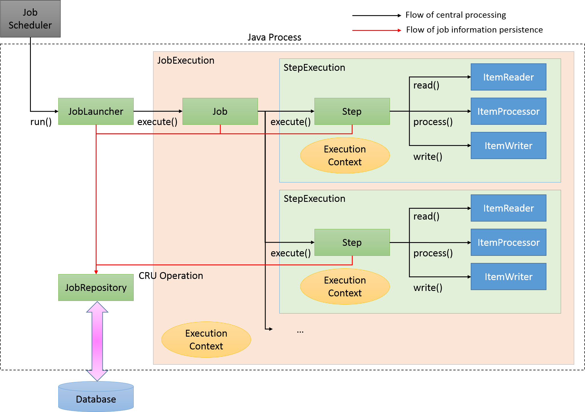

### 배치 애플리케이션이란?
단발성 대용량의 데이터를 처리하는 애플리케이션. 배치 어플리케이션은 다음의 조건을 만족해야한다.
- 대용량: **대량의 데이터**를 가져오거나, 계산하는 등의 처리가 가능해야 한다.
- 자동화:  사용자의 개입 없이 **자동**으로 실행.
- 견고성: **충돌/중단 없이** 진행되어야 한다.
- 신뢰성: 로깅 알림을 통해 **이슈를 추적**.
- 성능: **독립적인 수행**과 **퍼포먼스**가 보장되어야한다.

### Reader & Writer
|Data|기술|설명|
|---|---|---|
|Datbase|jdbc|페이징, 커서 업데이트 등|
|Datbase|Hiberbate|페이징 커서
|Datbase|JPA|페이징 사용 가능
|File|Flat file|지정한 구분자로 파싱 지원
|File|XML|XML 파싱 지원
<<<<<<< HEAD

</br>

### 스프링 배치 기본 구조 & 처리 흐름도


[reference](https://terasoluna-batch.github.io/guideline/5.0.0.RELEASE/en/Ch02_SpringBatchArchitecture.html)


[reference](https://terasoluna-batch.github.io/guideline/5.0.0.RELEASE/en/Ch02_SpringBatchArchitecture.html)

### Job
- 일련의 프로세스를 요약하는 단일 실행 단위.

``` java
@Bean
public Job simpleJob() {
    return jobBuilderFactory.get("Job Name")
        .start(step())
        .build();
}
```

### Step
- Job을 구성하는 처리 단위. 하나의 Job에 여러 Step이 포함될 수 있다. 조건부 수행, 병렬화 등 가능.

``` java
@Bean Step stepBean() {
    return stepBuilderFactory.get("simpleStep1")
    .tasklet((contribution, chunkContext) -> {
        log.info(">>> This is Step1 <<<");
         return RepeatStatus.FINISHED;
    })
    .build();
}
```

## Meta-Data Schema


[reference](https://docs.spring.io/spring-batch/docs/current/reference/html/schema-appendix.html)


### BATCH_JOB_INSTANCE
- JobInstance와 관련된 정보를 담고있다. 전체 계층 구조의 최상위 역할을 한다.